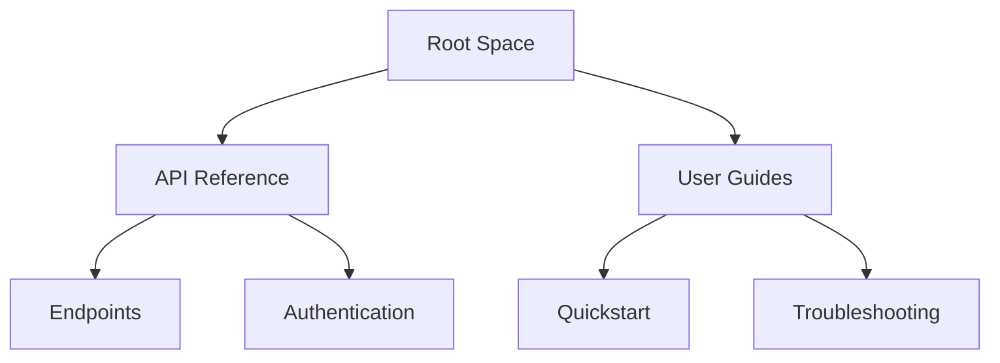

## Overview

MOHD SHABAN provides a flexible documentation platform where you create spaces to organize content, define page types with clear hierarchies, and collaborate using version control. Master these core concepts to build efficient, scalable documentation for your projects.

<Columns cols={3}>
  <Card title="Spaces & Organization" icon="layers" href="#spaces">
    Group related pages into dedicated spaces for better management.
  </Card>
  <Card title="Page Types" icon="file-text" href="#page-types">
    Use standard and custom page types to structure your content.
  </Card>
  <Card title="Collaboration" icon="users" href="#collaboration">
    Work with teams using version control and review workflows.
  </Card>
</Columns>

## Documentation Spaces and Organization

Organize your documentation into spaces, which act as top-level containers for pages. You create a space for each project or topic area, such as "API Reference" or "User Guides".

<Steps>
  <Step title="Create a Space" icon="plus">
    Navigate to the dashboard and select "New Space". Enter a name like "Project Docs" and set permissions.
  </Step>
  <Step title="Add Pages" icon="file-plus">
    Within the space, create child pages. Use the hierarchy view to drag and reorder.
  </Step>
  <Step title="Set Permissions" icon="shield">
    Assign roles like Editor or Viewer to team members.
  </Step>
</Steps>



<Callout kind="tip">
  Limit spaces to 10-15 major categories to avoid fragmentation. Use tags for cross-space searches.
</Callout>

## Page Types and Hierarchies

MOHD SHABAN supports predefined page types like `concepts.mdx`, `guides.mdx`, and `reference.mdx`. You maintain hierarchies with parent-child relationships for intuitive navigation.

<Tabs>
  <Tab title="Concepts" icon="lightbulb">
    Explain foundational ideas. Use for overviews and terminology.

    Example structure in a `concepts.mdx` file:

    ```yaml
    ---
    title: Authentication
    description: Learn how MOHD SHABAN handles user sessions.
    ---
    ```

    Focus on "why" and "what".
  </Tab>
  <Tab title="Guides" icon="book-open">
    Provide step-by-step instructions.

    ```yaml
    ---
    title: Onboarding Guide
    description: Set up your first documentation space.
    ---
    ```

    Emphasize "how".
  </Tab>
  <Tab title="Reference" icon="code">
    Detail APIs, components, and specs.

    ```yaml
    ---
    title: API Endpoints
    description: Complete list of available endpoints.
    ---
    ```

    Include code samples and parameters.
  </Tab>
</Tabs>

| Page Type   | Purpose                  | Example Use Case          |
|-------------|--------------------------|---------------------------|
| Concepts   | Foundational knowledge  | Core Concepts, Glossary  |
| Guides     | Procedural instructions | Installation, Migration  |
| Reference  | Technical details       | API Docs, Component Props|

## Collaboration and Version Control

Collaborate seamlessly with Git-based version control. You branch, commit changes, and merge via pull requests.

<CodeGroup tabs="Git CLI,GitHub">
  ```bash
  git checkout -b feature/new-page
  git add concepts.mdx
  git commit -m "Add core concepts page"
  git push origin feature/new-page
  ```
  ```bash
  # Create PR on GitHub UI
  # Review changes and merge
  gh pr create --title "Add core concepts" --body "Explains spaces and page types"
  ```
</CodeGroup>

<Expandable title="Advanced Workflows" default-open="false">
  Use protected branches for production spaces. Enable CI/CD to auto-deploy previews on PRs.

  Integrate with tools like Slack for notifications:

  ```yaml
  # .github/workflows/docs.yml
  name: Deploy Docs
  on: pull_request
  jobs:
    preview:
      runs-on: ubuntu-latest
      steps:
        - uses: actions/checkout@v4
  ```
</Expandable>

<Callout kind="info">
  Always write descriptive commit messages. Reference issues with `fixes #123`.
</Callout>

These concepts form the foundation. Apply them to streamline your documentation workflow in MOHD SHABAN.